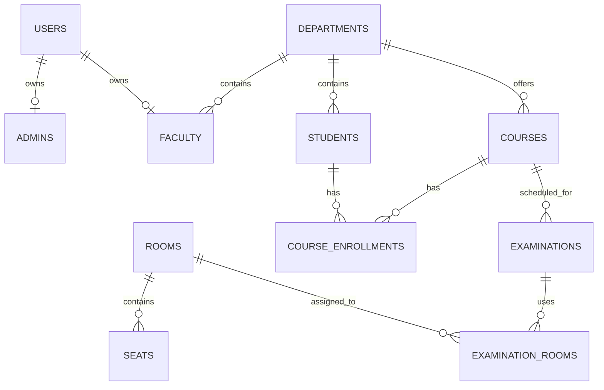

# ER Diagram

```mermaid
erDiagram
    USERS ||--o| ADMINS : owns
    USERS ||--o| FACULTY : owns
    DEPARTMENTS ||--o{ FACULTY : contains
    DEPARTMENTS ||--o{ STUDENTS : contains
    DEPARTMENTS ||--o{ COURSES : offers
    ROOMS ||--o{ SEATS : contains
    STUDENTS ||--o{ COURSE_ENROLLMENTS : has
    COURSES ||--o{ COURSE_ENROLLMENTS : has
    COURSES ||--o{ EXAMINATIONS : scheduled_for
    EXAMINATIONS ||--o{ EXAMINATION_ROOMS : uses
    ROOMS ||--o{ EXAMINATION_ROOMS : assigned_to
```

`Seating` and `Invigilation` are part of the complete system but are not implemented in the S1-S4 database build because their implementation begins in later master-plan sprints.
