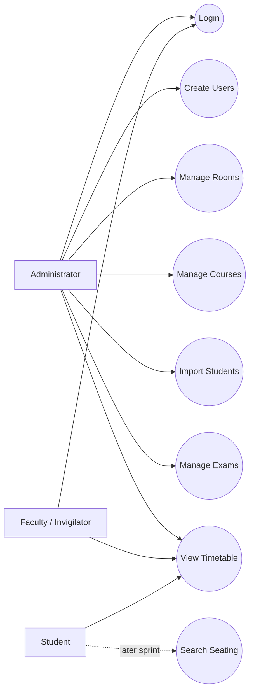

# Use Case Diagram

```mermaid
flowchart LR
    Admin[Administrator]
    Faculty[Faculty / Invigilator]
    Student[Student]

    Admin --> Login((Login))
    Admin --> Users((Create Users))
    Admin --> Rooms((Manage Rooms))
    Admin --> Courses((Manage Courses))
    Admin --> Import((Import Students))
    Admin --> Exams((Manage Exams))
    Admin --> Timetable((View Timetable))

    Faculty --> Login
    Faculty --> Timetable

    Student --> Timetable
    Student -. later sprint .-> Seating((Search Seating))
```
